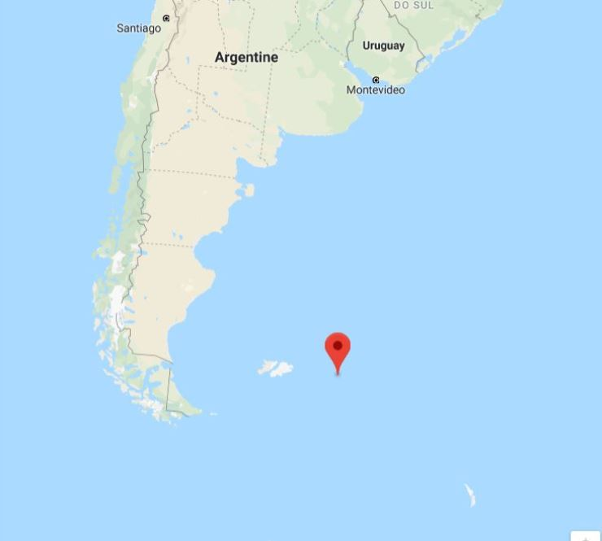
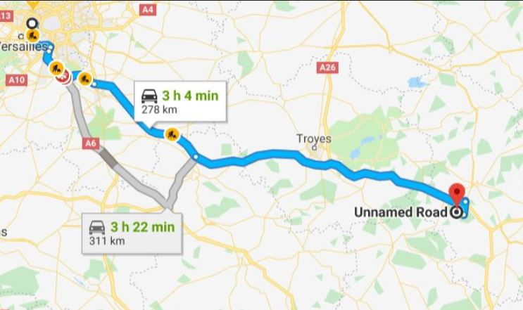
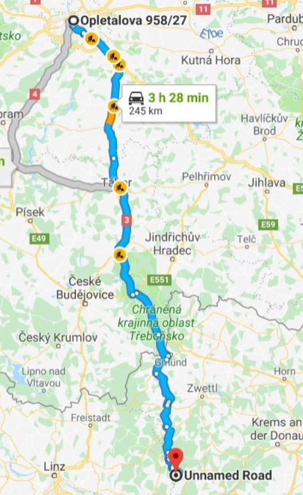

# NASA-chatbot
- Fenohanta RAKOTONDRASOA 
>A course project with some 🚀**NASA**-related data given by some APIs and with 🗺️**Google maps** client application(google geolcate is not free-to-use☹️).


🔨## How to use it

Clone the repository to your desktop.
Then:
```
cd your/directory/path
npm install
node server.js
```
The application is running on the console.

🏃‍♀️#How it works

It runs by recongnizing some patterns like "**hello**", "**where is the ISS now?**","**how many people are in space right now**" or **locating the nearest meteorit impact from a given location**.

### hello :
```
hello
NASA-Bot> hello to you too!
```
### ISS Location now
```
>where is the Iss right now ?
NASA-Bot> Searching ISS Location ...
>NASA-Bot> The Iss is :
Latitude :-51.4427
Longitude :-53.6255
Right now (1554200980)
NASA-Bot> Check it on the browser!
```

>*The ISS is above this location right now.*

### Number of people in space right now
```
>how many people are in space today?
NASA-Bot> Searching Non-Earthian-For-A-Time-People  ...
NASA-Bot> There is 6 people in space.
```
### Nearest meteorit impact from a given place


#### Recommendations
It gives a couple of routes thanks to **Google maps**

 - Nearest from **Paris**:
```
>where is the nearest meteorite from paris
NASA-Bot> Searching nearest crashed meteor from paris...
paris
>NASA-Bot> Still searching ... Fell
@48.8587741,2.2069771, 48.8587741 2.2069771
NASA-Bot> The nearest meteor impact is the Bununu
At :
48  5
Check out the browser
```


- Nearest from **a specified adress**:
```
>where is the nearest meteorite from Wilsonova 300/8, 110 00 Vinohrady?

NASA-Bot> Searching nearest crashed meteor from Wilsonova 300/8, 110 00 Vinohrady...
Wilsonova 300/8, 110 00 Vinohrady
>NASA-Bot> Still searching ... Fell
@50.0832387,14.4328327, 50.0832387 14.4328327
NASA-Bot> The nearest meteor impact is the Kabo
At :
48.3  15
Check out the browser
```
